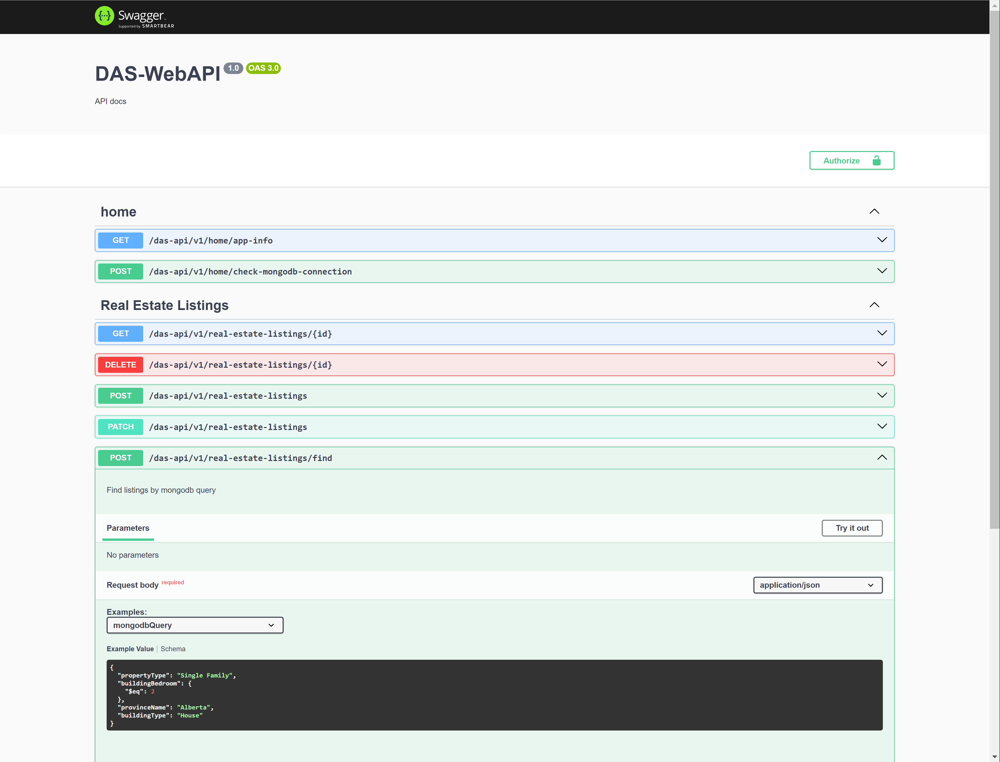
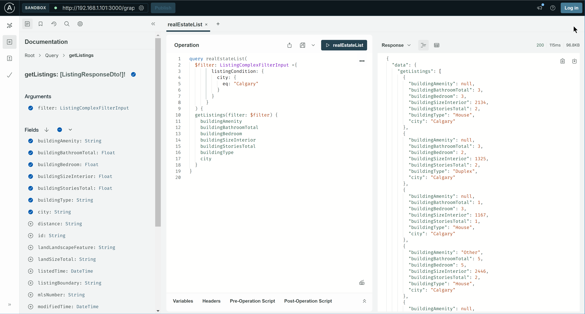
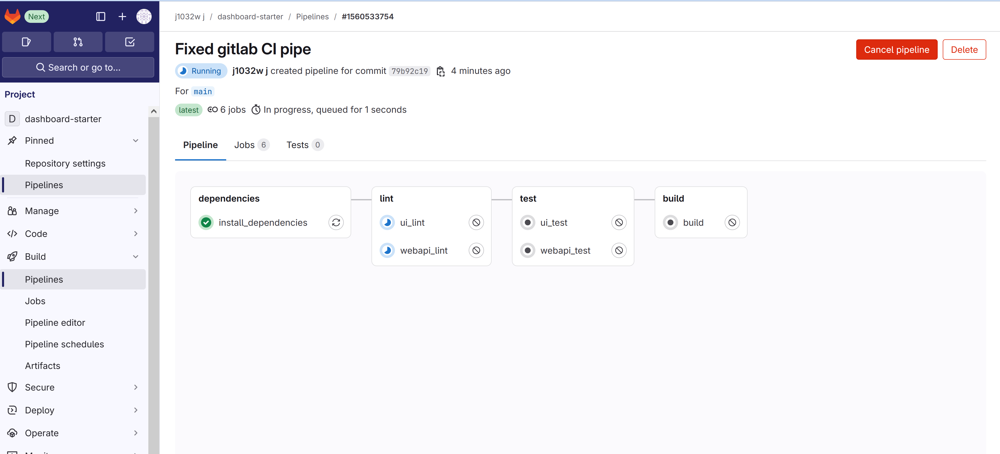
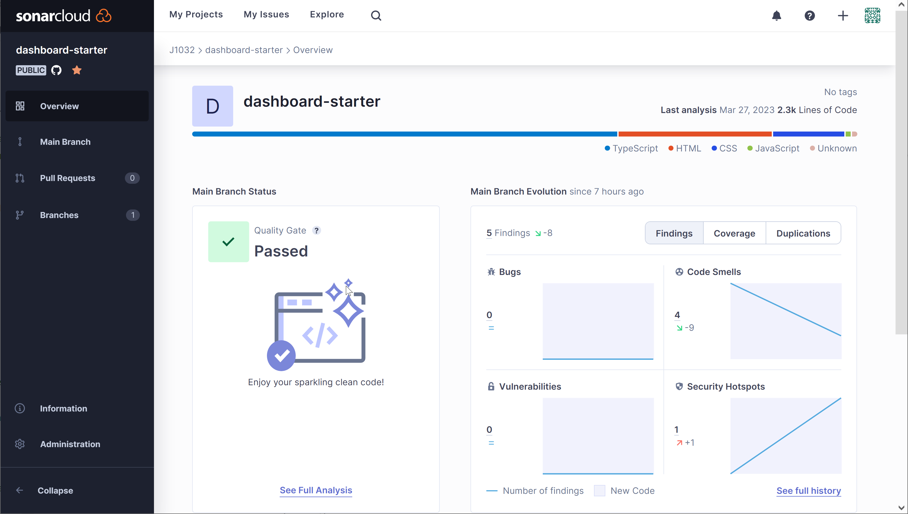

# Dashboard Starter
**A starter pack for building dashboards with Angular**\
[](https://sonarcloud.io/summary/new_code?id=j1032w_dashboard-starter)
[](https://sonarcloud.io/summary/new_code?id=j1032w_dashboard-starter)
[](https://sonarcloud.io/summary/new_code?id=j1032w_dashboard-starter)\
[](https://gitlab.com/j1032w/dashboard-starter/-/pipelines)
[](https://opensource.org/licenses/MIT)
<a href="https://github.com/j1032w/dashboard-starter" target="_blank"></a>
[](https://www.paypal.com/donate/?hosted_button_id=29ZE3URD5V9Q8)

#### Live Demo: https://www.j1032.com/dashboard
#### Also available: [ReactJS Edition](https://github.com/j1032w/react-dashboard-starter)


[](https://www.j1032.com/dashboard)

[](https://www.j1032.com/dashboard)

[]()


[]()


# Features
- **Technologies**:\
  Built with [Angular 18](https://angular.io), [Nest.js 9](https://nestjs.com/), [Nx 20](https://nx.dev/), [RxJS 7](https://rxjs.dev/), [Angular Material CDK 18](https://material.angular.io/cdk/categories) and [Bootstrap 5](https://getbootstrap.com/)  

- **Modern Development Practices**:\
  Mono-repo structure with [Nx](https://nx.dev/)\
  Containerized application stored on [Amazon ECR](https://gallery.ecr.aws/x0r2c3f9/das)\
  Angular standalone components and lazy loading\
  HTTP request throttling and caching\
  Liquid layout and SVG icons.
- **Testing**:\
  Unit testing with [Jest](https://jestjs.io/)\
  End-to-end(E2E) automation testing with [Cypress](https://www.cypress.io/)
- **Code Quality and CI/CD**:\
  Code scanned with [SonarQube](https://sonarcloud.io/project/overview?id=j1032w_dashboard-starter)\
  [Gitlab CI/CD pipeline](https://gitlab.com/j1032w/dashboard-starter/-/pipelines)\
  Integrated [Eslint](https://eslint.org/) and [Prettier](https://prettier.io/)


# Roadmap:
* [ ] Publish the dashboard module as a standalone npm package.
* [ ] Increase unit test coverage.
* [ ] Add integration tess for webapi.


# Getting Started
### Start with Pre-build Docker Image
The pre-build image may not include the latest changes.

1. Pull and run the production images from [Amazon ECR (https://gallery.ecr.aws/x0r2c3f9/das)](https://gallery.ecr.aws/x0r2c3f9/das)
```
docker compose -f docker-compose.prod.yml pull
docker compose -f docker-compose.prod.yml up
```
2. Navigate to the following URLs: http://localhost:80


### Start with Docker compose
1. Clone repository and Install dependencies
```
git clone https://github.com/j1032w/dashboard-starter.git
yarn install
```


2. Build and run the development server:
```
docker compose -f docker-compose.dev.yml build
docker compose -f docker-compose.dev.yml up
```

3. Navigate to the following URLs:
- UI: http://localhost:4200
- API (Swagger): http://localhost:3000/api-docs
- API (GraphQL Playground): http://localhost:3000/graphql
- Web API Inspect Port: 9229


### Start Locally with Node.js
Start development server
```
yarn dev
```

### Testing and Linting
```
yarn ui:test
yarn ui:lint

yarn web:test
yarn web:lint
```


# GitLab CI/CD
https://gitlab.com/j1032w/dashboard-starter/-/pipelines

[](https://gitlab.com/j1032w/dashboard-starter/-/pipelines)


# SonarQube scan result
https://sonarcloud.io/project/overview?id=j1032w_dashboard-starter

[](https://sonarcloud.io/summary/new_code?id=j1032w_dashboard-starter)
[](https://sonarcloud.io/summary/new_code?id=j1032w_dashboard-starter)  
[](https://sonarcloud.io/summary/new_code?id=j1032w_dashboard-starter)
[](https://sonarcloud.io/summary/new_code?id=j1032w_dashboard-starter)
[](https://sonarcloud.io/summary/new_code?id=j1032w_dashboard-starter)


[](https://sonarcloud.io/project/overview?id=j1032w_dashboard-starter)


# Support
This project is designed to be simple and customizable.\
Your contributions and donations are greatly appreciated!\
[](https://www.paypal.com/donate/?hosted_button_id=29ZE3URD5V9Q8)👈🏻👈🏻👈🏻
