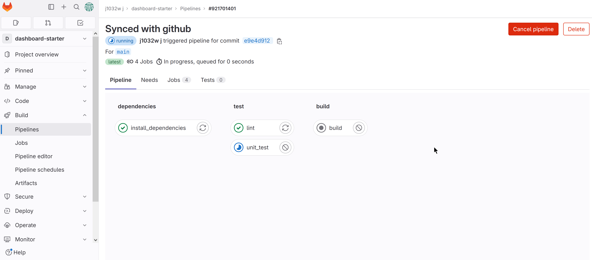

# Dashboard Starter
**A dashboard starter pack build with Angular.**\
[](https://sonarcloud.io/summary/new_code?id=j1032w_dashboard-starter)
[](https://sonarcloud.io/summary/new_code?id=j1032w_dashboard-starter)
[](https://sonarcloud.io/summary/new_code?id=j1032w_dashboard-starter)\
[](https://gitlab.com/j1032w/dashboard-starter/-/pipelines)
[](https://opensource.org/licenses/MIT)
<a href="https://github.com/j1032w/dashboard-starter" target="_blank"></a>
[](https://www.paypal.com/donate/?hosted_button_id=29ZE3URD5V9Q8)


#### The React edition of Dashboard Starter can be found at https://github.com/j1032w/das-mono-nestjs-reactjs

# Demo
https://www.j1032.com/dashboard \
&nbsp;

[](https://www.j1032.com/dashboard)
[](https://www.j1032.com/dashboard)


# What I have got here
- Built with [Angular 15](https://angular.io), [Typescript 4](https://www.typescriptlang.org/), [SCSS](https://sass-lang.com/), [RxJS 7](https://rxjs.dev/), [Angular Material CDK 15](https://material.angular.io/cdk/categories) and [Bootstrap 5](https://getbootstrap.com/)
- Container and presentational components architecture
- Ahead-of-time ([AOT](https://angular.io/guide/aot-compiler)) compilation, Module lazy loading, HTTP request throttling and caching, 
- Responsive liquid layout, SVG Icons
- Unit testing with [Jest](https://jestjs.io/) and E2E automation testing with [Cypress](https://www.cypress.io/)
- [Containerized application](https://www.docker.com/) hosted on [Google Cloud](https://cloud.google.com/)
- Source code scanned with [SonarQube](https://sonarcloud.io/project/overview?id=j1032w_dashboard-starter)
- [Eslint](https://eslint.org/) and [Prettier](https://prettier.io/) integration
- [Gitlab CI/CD](https://gitlab.com/j1032w/dashboard-starter/-/pipelines) pipeline


# Roadmap: 
* [ ] Update to Nx workspace and monorepo architecture
* [ ] Turn dashboard module to standalone npm package
* [ ] Increase unit tests coverage
* [ ] Add more e2e automation tests


&nbsp;

It's designed to be easy to understand and use. Feel free to customize it to fit your needs.\
Every donation is appreciated and will go towards the development of this project. Thank you for your support!
[](https://www.paypal.com/donate/?hosted_button_id=29ZE3URD5V9Q8)👈🏻👈🏻👈🏻


# Quick start
1. Clone repository
```
git clone https://github.com/j1032w/dashboard-starter.git
```
2. Running development server
```
yarn install
yarn start:dev
```
3. Navigate to [http://localhost:4200/](http://localhost:4200/)
<br/>
<br/>

#### Running unit tests
```
yarn test
```

#### Running e2e tests
```
yarn cypr
```
#### Running eslint
```
yarn lint
```

#### Running build
``` 
yarn build
``` 

# Docker
### Deployment
1. Running container, fetch image form Google cloud Artifact Registry.
```
docker run -d --pull=always -p 4201:80 --name=das-ui  northamerica-northeast2-docker.pkg.dev/j1032-dashboard-starter/docker/das-ui:develop
```
2. Navigate to http://localhost:4201


### Build container with docker-compose
1. Run followed command in project directory.
```
docker compose build
docker compose up -d
```
2. Navigate to http://localhost:4201

### Build container with Docker cli

```
docker image build --progress=plain --tag das-ui:develop 

docker container run -d -p 4201:80 --rm das-ui:develop
```  


# GitLab CI/CD
https://gitlab.com/j1032w/dashboard-starter/-/pipelines

[](https://gitlab.com/j1032w/dashboard-starter/-/pipelines)


# SonarQube scan result
https://sonarcloud.io/project/overview?id=j1032w_dashboard-starter

[](https://sonarcloud.io/summary/new_code?id=j1032w_dashboard-starter)
[](https://sonarcloud.io/summary/new_code?id=j1032w_dashboard-starter)  
[](https://sonarcloud.io/summary/new_code?id=j1032w_dashboard-starter)
[](https://sonarcloud.io/summary/new_code?id=j1032w_dashboard-starter)
[](https://sonarcloud.io/summary/new_code?id=j1032w_dashboard-starter)


[](https://sonarcloud.io/project/overview?id=j1032w_dashboard-starter)


<a href="https://statcounter.com/" target="_blank"></a>

