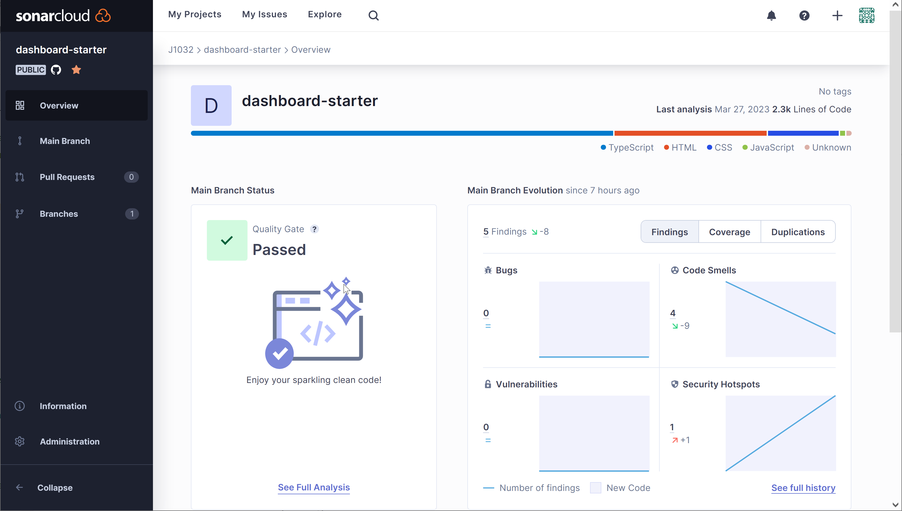

# Dashboard Starter
**A dashboard boilerplate project.**\
[](https://opensource.org/licenses/MIT)
<a href="https://github.com/j1032w/dashboard-starter" target="_blank"></a>\
[](https://sonarcloud.io/summary/new_code?id=j1032w_dashboard-starter)
[](https://sonarcloud.io/summary/new_code?id=j1032w_dashboard-starter)
[](https://sonarcloud.io/summary/new_code?id=j1032w_dashboard-starter)

[](https://www.j1032.com/dashboard)


# Live Demo
https://www.j1032.com/dashboard


# What I've got here
- Built on Angular, Typescript, SCSS, [Angular Material CDK](https://material.angular.io/cdk/categories) and [Bootstrap](https://getbootstrap.com/)
- Ahead-of-time ([AOT](https://angular.io/guide/aot-compiler)) compile
- SVG Icons
- Unit testing with [Jest](https://jestjs.io/)
- Dockerized application
- Source code scanned with [SonarQube](https://sonarcloud.io/project/overview?id=j1032w_dashboard-starter)
- MIT License

You will need to adjust the code to fit your specific needs, and I hope that this project can give you a good starting point.


# Quick start
1. Clone repository
```
git clone https://github.com/j1032w/dashboard-starter.git
```
2. Running development server
```
yarn install
yarn start:dev
```
3. Navigate to [http://localhost:4200/](http://localhost:4200/)

### Running unit tests
```
yarn test
```

# Docker
### Deployment
Fetch container image form Google cloud Artifact Registry.\
If container is created, you can access api on http://localhost:4200
```
docker run -d --pull=always -p 4200:80 --name=dashboard-starter-ui  northamerica-northeast2-docker.pkg.dev/j1032-dashboard-starter/docker/dashboard-starter-ui:develop
```

### Build container with docker-compose
Run followed command in project directory.
```
docker compose build
docker compose up -d
```

### Build container with Docker cli

```
docker image build --progress=plain --tag dashboard-starter-ui:develop 

docker container run -d -p 4200:80 --rm dashboard-starter-ui:develop
```  


## SonarQube scan result
[](https://sonarcloud.io/summary/new_code?id=j1032w_dashboard-starter)
[](https://sonarcloud.io/summary/new_code?id=j1032w_dashboard-starter)  
[](https://sonarcloud.io/summary/new_code?id=j1032w_dashboard-starter)
[](https://sonarcloud.io/summary/new_code?id=j1032w_dashboard-starter)
[](https://sonarcloud.io/summary/new_code?id=j1032w_dashboard-starter)


[](https://sonarcloud.io/project/overview?id=j1032w_dashboard-starter)


